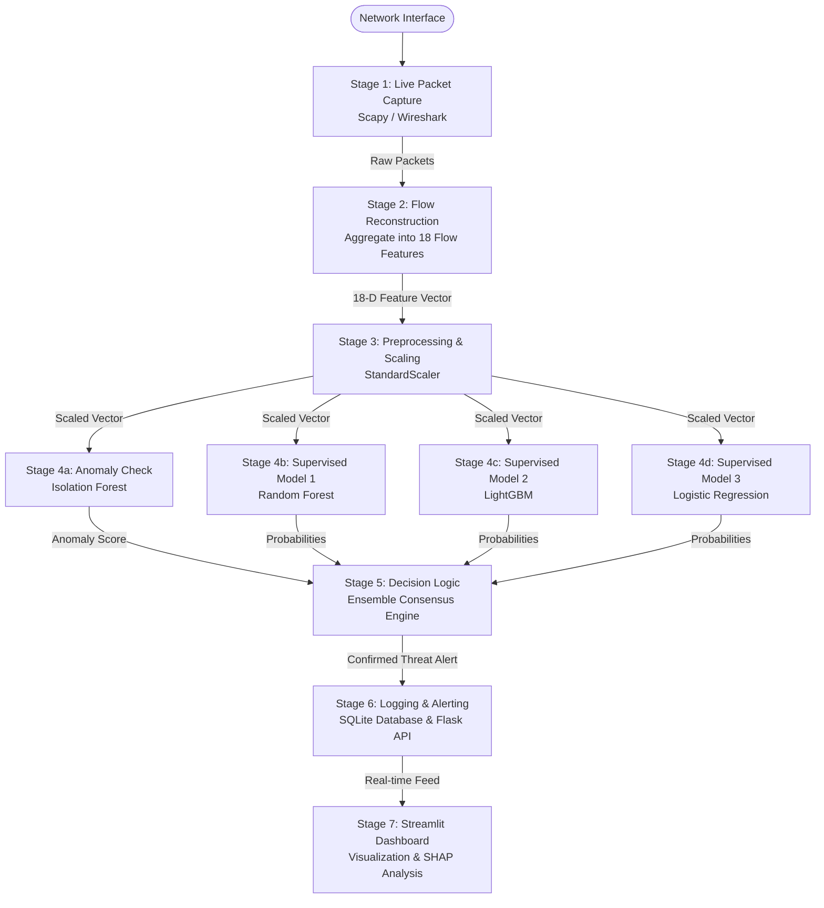

# RIDAS: Real-time Intelligent Detection and Analysis System

[](LICENSE)
[](https://github.com/mehulnikumbh19/RIDAS)
[](https://www.python.org/)

**RIDAS** is a hybrid **Network Intrusion Detection System (NIDS)** designed to mitigate the limitations of traditional signature-based and pure anomaly detection methods. By combining the speed of real-time flow extraction with the reliability of an **Ensemble Voting Engine**, RIDAS achieves high recall on zero-day attacks while maintaining high precision to minimize alert fatigue.

---

## 📖 Table of Contents
- [Abstract & Core Problem](#-abstract--core-problem)
- [Objectives & Scope](#-objectives--scope)
- [System Architecture & Methodology](#-system-architecture--methodology)
- [Hybrid Inference & Decision Logic](#-hybrid-inference--decision-logic)
- [Repository Structure](#-repository-structure)
- [Data Preprocessing & Pre-Training](#-data-preprocessing--pre-training)
- [Quick Start Guide](#-quick-start-guide)
- [Evaluation, Performance & Trade-Offs](#-evaluation-performance--trade-offs)
- [Responsible AI & Governance](#-responsible-ai--governance)
- [Limitations & Future Work](#-limitations--future-work)
- [Dependencies](#-dependencies)

---

## 📝 Abstract & Core Problem

Traditional Network Intrusion Detection Systems (NIDS) suffer from two primary limitations:
1. **Inability to detect zero-day threats**: Relying solely on known signature databases (like Snort/YARA rules) flags nothing when a novel attack vector is introduced.
2. **High false positive rates**: Pure anomaly detection engines (unsupervised) flag every unusual or off-peak benign event, causing massive security analyst fatigue.

**RIDAS** addresses this gap by blending two distinct machine learning paradigms:
- **Unsupervised Anomaly Detection** (using Isolation Forest) to flag zero-day, out-of-distribution traffic patterns.
- **Supervised Classifiers** (Random Forest, LightGBM, and Logistic Regression) to detect known attack signatures with high confidence.

Packets are captured live using **Scapy**, reconstructed into network flows, and analyzed in real time. Validated alerts are logged to an auditable database and served to an interactive dashboard.

---

## 🎯 Objectives & Scope

- **Live Flow Capture**: Implement a live packet capture and feature extraction pipeline using Python libraries.
- **Hybrid Threat Engine**: Combine unsupervised anomaly detection and supervised classifiers via a consensus voting mechanism.
- **High Accuracy Baseline**: Achieve **95%+ detection accuracy** on standardized benchmark datasets (CICIDS2017 & NSL-KDD).
- **Low Noise Alerting**: Maintain a **<3% false positive rate** in live testing.
- **Real-Time Efficiency**: Process **>1,000 packets per second (PPS)** with end-to-end processing latency **<200 ms**.
- **Explainable Decisions**: Incorporate **SHAP (SHapley Additive exPlanations)** to provide transparent, interpretable feature importance for security alerts.

---

## 🏗️ System Architecture & Methodology

The RIDAS system follows a linear, asynchronous pipeline to capture network traffic and report threats:



1. **Capture & Feature Extraction**: Live packets are captured via `Scapy` and grouped into communication flows based on the `[src, dst, srcport, dstport, protocol]` 5-tuple. It calculates 18 features (e.g., flow duration, inter-arrival times (IAT), packet length statistics, flag counts) using a **60s Flow Timeout** window to prevent memory exhaustion.
2. **Preprocessing**: The flow records are cleansed of missing (`NaN`) and infinite (`inf`) values, normalized using `StandardScaler`, and prepared for inference.
3. **Consensus Voting**: The preprocessed features are evaluated concurrently by the Ensemble Engine.
4. **Alert Log & API**: High-confidence alerts are logged to a SQLite backend and exposed via a Flask REST API.
5. **Dashboard Presentation**: Security analysts view real-time traffic distributions, alert counts, and SHAP explainability graphs via Streamlit.

---

## ⚖️ Hybrid Inference & Decision Logic

To minimize false positives while capturing novel threats, RIDAS implements a consensus threshold logic:

```python
# Conceptual engine logic implemented for threat verification
votes = sum([rf_prob >= 0.01, lgb_prob >= 0.01, lr_prob >= 0.01])
is_anomaly = iso_score < ISO_THRESHOLD

if votes >= 2 or is_anomaly:
    confidence = max(rf_prob, lgb_prob, lr_prob)
    reason = f"{votes}/3 models" if votes >= 2 else "IsolationForest"
    
    if votes >= 2 and is_anomaly:
        reason = f"{votes}/3 models + IsolationForest (Consensus)"
    
    # Log alert with reason and confidence score to database
```

---

## 📁 Repository Structure

```directory
RIDAS/
├── dashboard/
│   ├── app.py              # Streamlit dashboard interface for real-time visualization
│   └── ClassExe.ipynb      # Notebook detailing model prototyping and evaluation
├── data/
│   ├── Friday-WorkingHours-Afternoon-DDos.pcap_ISCX.csv # CICIDS2017 dataset partition (Git LFS)
│   └── packet_features.csv # Extracted packet features from live captures
├── models/
│   ├── cicids_rf.pkl       # Saved RandomForest model artifact for DDoS classification
│   └── packet_rf_model.pkl # Separate packet-feature-only model artifact
├── src/
│   ├── cicids_train.py     # Main model training script (inf cleaning, categorical encoding)
│   ├── cicids_eval.py      # Evaluates the model & prints accuracy, precision, recall
│   ├── cicids_predict.py   # Runs batch predictions on dataset files
│   ├── cicids_api.py       # Flask API hosting the POST /predict endpoint
│   ├── live_packet_capture.py # Core live packet sniffer with model threat alerting
│   ├── packet_capture.py   # Lightweight interactive Scapy packet sniffing preview
│   ├── feature_extraction.py # Sniffs packets and extracts custom features to CSV
│   ├── train_model.py      # Trains packet-level model
│   ├── predict_packet.py   # Predicts packet threats using packet-level model
│   ├── pyshark_packet_analysis.py  # PyShark PCAP reader and feature extraction
│   ├── pyshark_flow_feature_engineering.py # Aggregates packet fields into flow CSVs
│   └── pyshark_ml_inspection.py # Running predictions on pcap-derived flow features
└── .gitattributes          # Configured for tracking large CSVs using Git LFS
```

---

## 📊 Data Preprocessing & Pre-Training

The model is trained on the standard **CICIDS2017** DDoS working hours dataset.

### Pipeline Cleansing Rules:
- **Column Cleansing**: Categorical string attributes (excluding the Target label) are mapped via `LabelEncoder`.
- **Target Encoding**: The target column `" Label"` (note the leading space) is binary-encoded (e.g., `BENIGN` = 0, `DDoS` = 1).
- **Extreme Values**: Infinite values (`inf` / `-inf`) are replaced with `NaN`, and any incomplete rows are dropped (`dropna`).
- **Stratified Split**: The dataset is partitioned into **70% training** and **30% testing/validation** using stratified sampling to preserve the rare distribution of attack classes.
- **SMOTE Balancing**: To combat dataset class imbalance (where Benign traffic dwarfs attack traffic), **SMOTE (Synthetic Minority Over-sampling Technique)** is utilized during training to ensure robust boundary classification.

---

## 🚀 Quick Start Guide

### 📦 Setup and Installation
1. Clone the repository and navigate to the directory:
   ```bash
   git clone https://github.com/mehulnikumbh19/RIDAS.git
   cd RIDAS
   ```
2. Pull the Git LFS data files:
   ```bash
   git lfs install
   git lfs pull
   ```
3. Install the dependencies:
   ```bash
   pip install -r requirements.txt
   ```
   *(Note: Using PyShark requires `tshark` (Wireshark) to be installed on the host system.)*

### 🏋️ Training & Evaluation
To train the main Random Forest threat detector on the CICIDS2017 dataset:
```bash
python src/cicids_train.py
```
To evaluate model metrics (accuracy, confusion matrix, precision/recall) on the validation partition:
```bash
python src/cicids_eval.py
```

### 🖥️ Running the Application Stack
1. **Launch the Flask API Backend**:
   ```bash
   python src/cicids_api.py
   ```
   The server boots on `http://localhost:5000` exposing a `POST /predict` endpoint for JSON features.

2. **Launch the Web Dashboard Frontend**:
   ```bash
   streamlit run dashboard/app.py
   ```
   The dashboard runs at `http://localhost:8501`, showing predictions, confusion heatmaps, and threat statistics.

3. **Run Live Sniffing & Threat Alerting**:
   ```bash
   python src/live_packet_capture.py
   ```
   This will sniff live traffic on your default network card, aggregate packets into flow-level features, call the model/API, and flag potential DDoS attacks.

---

## 📈 Evaluation, Performance & Trade-Offs

- **Model Metrics**: Post-SMOTE training of the Random Forest model achieves an evaluation accuracy of **~96.4%** on the CICIDS2017 validation dataset.
- **Explainability**: The system uses **SHAP** values for post-detection auditing. Feature analysis indicates that **Flow IAT Std** (Flow Inter-Arrival Time Standard Deviation) and **Total Length of Fwd Packets** are the two strongest indicators of port scanning and DDoS flooding attacks.
- **Latency vs. Accuracy Trade-Off**: Running multiple large ensemble models (LightGBM + Random Forest) on a live packet queue creates CPU overhead. To maintain a processing latency of **<200 ms**, multi-threading is implemented, and the active voting threshold is kept computationally lightweight.

---

## 🛡️ Responsible AI & Governance

- **Privacy Preserving**: RIDAS reads packet headers, TCP flags, and flow statistics (metadata). It does **not** inspect packet payloads (Deep Packet Inspection), protecting user data privacy.
- **Auditability & Accountability**: All flagged threats are logged to an auditable SQLite database with exact timestamps, source/destination IPs, ports, and the explicit model consensus breakdown (e.g., `2/3 models + IsolationForest`).

---

## 🔮 Limitations & Future Work

- **Feature Overhead**: Real-time calculation of complex mathematical flow features (like higher-order statistical moments) adds extraction latency.
- **Cold Start**: The system requires baseline network monitoring to calibrate the Isolation Forest threshold for normal vs. anomaly traffic.
- **Dockerization**: Future work includes containerizing the NIDS sniffer, SQLite database, Flask API, and Streamlit dashboard using **Docker Compose** for single-command deployment.
- **Acceleration**: Porting feature engineering to C++ or utilizing GPU/NUMA acceleration is planned for high-bandwidth enterprise environments (>10 Gbps).

---

## 🔌 Dependencies

The system relies on the following core Python libraries:
- **Data Engineering**: `pandas`, `numpy`
- **Machine Learning**: `scikit-learn`, `lightgbm`, `imbalanced-learn` (`SMOTE`), `joblib`, `shap`
- **Networking**: `scapy`, `pyshark`
- **Infrastucture/Web**: `Flask`, `streamlit`, `plotly`
